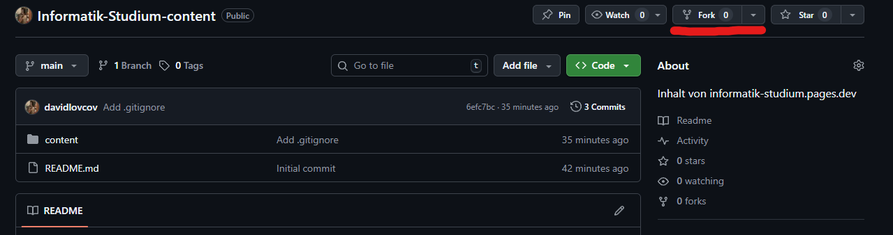
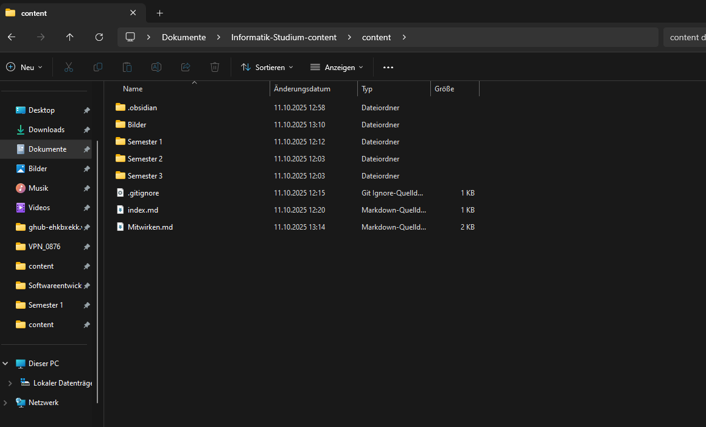
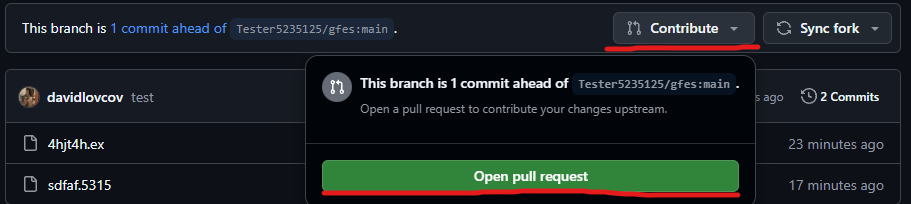
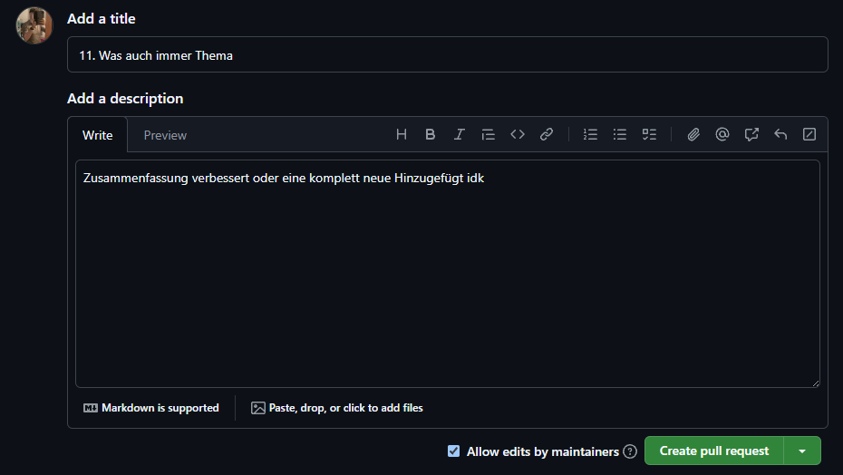

## Es gibt 2 Möglichkeiten, wie man mitwirken kann
### 1. Änderungen oder Zusammenfassungen in der What'sApp Gruppe oder privat schicken. Ich kann sie dann in Markdown, so gut wie möglich nachmachen

### 2. Direkt über GitHub mit Markdown und MathJax (Obsidian empfohlen)
---
#### 1. Repository auf GitHub forken (Namen am besten behalten)
---


#### 2. Fork-Repository klonen
---
```git
git clone https://github.com/DEIN_USERNAME/Informatik-Studium-content

cd Informatik-Studium-content
```
**Falls man zuvor schon geklont hat einfach folgenden Befehl ausführen oder den Ordner löschen**
```git
rm -r Informatik-Studium-content
```

#### 3. Mit dem Haupt-Repository synchronisieren
---
```git
git remote add upstream https://github.com/davidlovcov/Informatik-Studium-content
git remote -v
```
**Es sollte dann sowas ausgeben**
```git
origin  https://github.com/davidlovcov/Informatik-Studium-content (fetch)
origin  https://github.com/davidlovcov/Informatik-Studium-content (push)
upstream        https://github.com/DEIN_USERNAME/Informatik-Studium-content (fetch)
upstream        https://github.com/DEIN_USERNAME/Informatik-Studium-content (push)
```

#### 4. Nun kann im *content*-Ordner gearbeitet werden
---

#### 5. Änderungen hochladen
---
```git
git add .

git commit -m "HIER DIE ÄNDERUNGEN HINSCHREIBEN"

git push origin main
```

#### 6. Auf GitHub in Fork-Repository gehen und ein pull request erstellen
---


#### 7. Titel und Beschreibung ausfüllen (optional) und "_Create pull request_" drücken
---


<hr>

<div style="display: flex; justify-content: space-between;">

  <a href="/">← Zurück</a>

</div>
